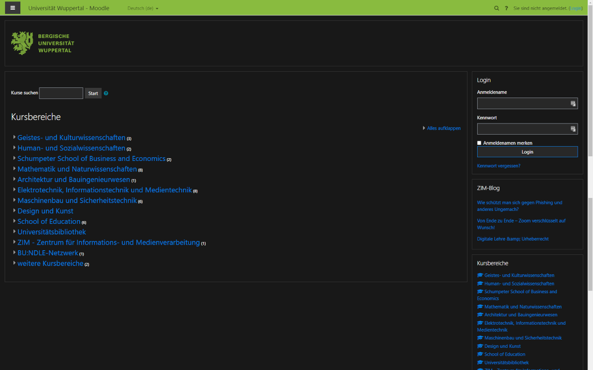
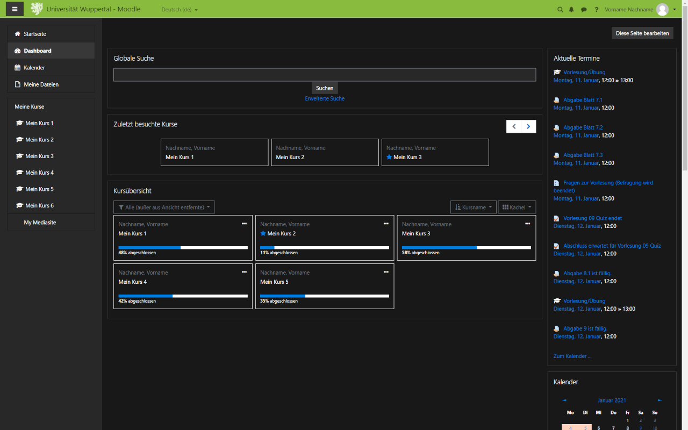
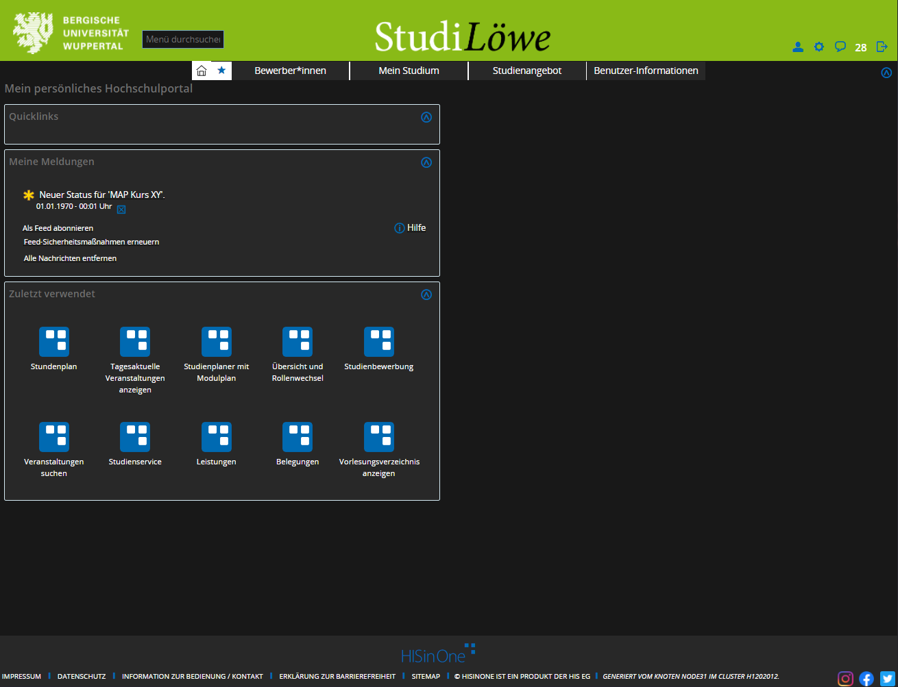
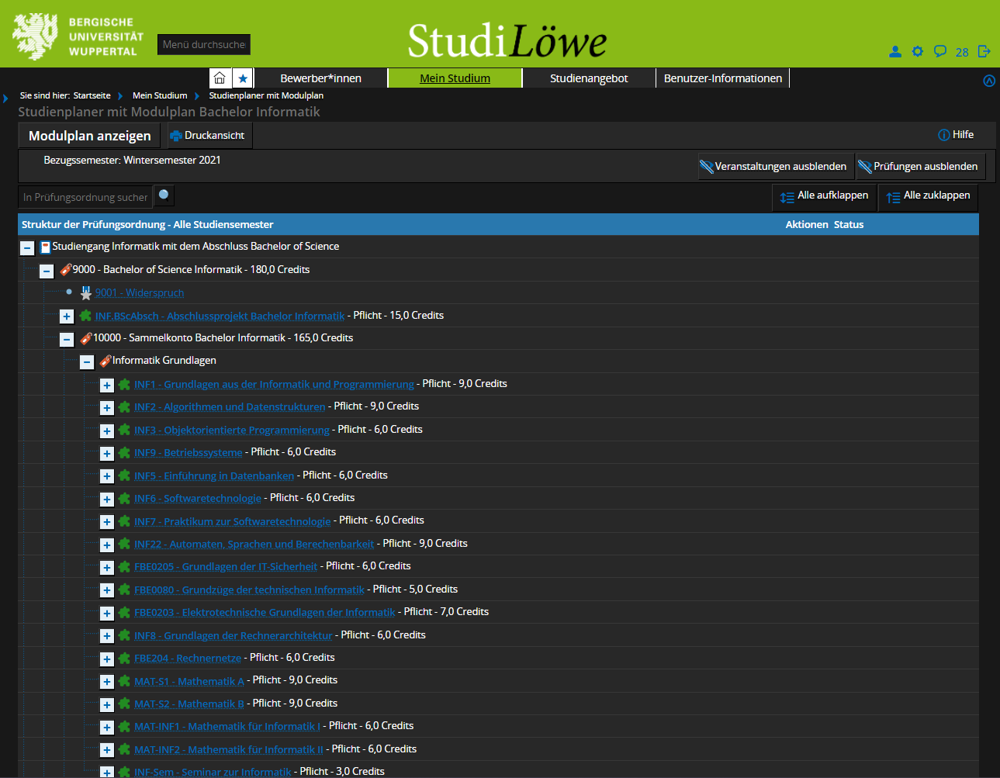

# Darkmode für BUW Moodle und Studilöwe
Diese Extension erweitertet [Moodle](https://moodle.uni-wuppertal.de/) und [Studilöwe](https://studilöwe.uni-wuppertal.de/) von BUW (Bergische Universität Wuppertal) um einen Darkmode.

## Download
* [Firefox Addon](https://addons.mozilla.org/de/firefox/addon/darkmode-f%C3%BCr-buw-moodle/)
* [Chrome Extension](https://chrome.google.com/webstore/detail/darkmode-f%C3%BCr-buw-moodle/kipahojjgbnhnjjfpamggpealcdaalfp?hl=de)

## Disclaimer
Ich bin kein Javascript oder Browser-Extension Entwickler. Ich habe bisher keine anderen Extensions als diese entwickelt. Es können also durchaus Fehler in der grafischen Darstellung von Inhalten auftreten. Wenn Du einen Fehler findest, freue ich mich, wenn Du ihn [hier](https://github.com/eliastheis/moodle-darkmode/issues/new/choose) meldest. Ich werde mein Bestes geben alle bekannten Fehler schnellstmöglich zu korrigieren, garantiere aber für nichts. Wenn Du selber diese Extension verbessern möchtest, fühl Dich frei, dies zu tun. Der Code ist ja schließlich Open-Source.

## Screnhots
 
 
 

